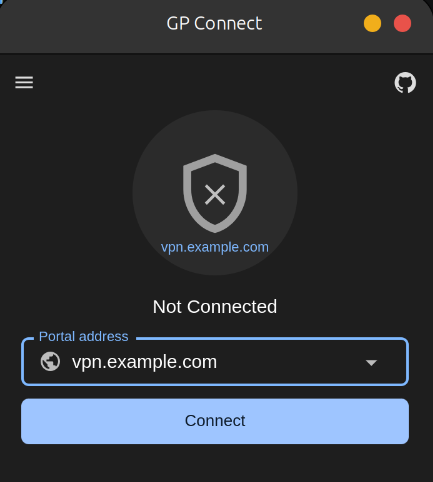

# GP Connect (GlobalProtect-openconnect)

A modern, open-source GlobalProtect VPN client for Linux, built on [OpenConnect](https://www.infradead.org/openconnect/) with full support for SSO and MFA authentication.

<p align="center">
  
</p>

## Features

- **Full GUI + CLI** — Desktop app with system tray and a feature-complete command-line client
- **SSO / SAML Authentication** — Handles browser-based single sign-on flows
- **Multi-Factor Authentication** — Supports multi-round MFA challenges at portal and gateway
- **Portal & Gateway Fallback** — Automatically handles separate portal/gateway auth setups
- **OS Spoofing** — Present as Windows or macOS client when required by your VPN policy
- **HIP Report** — Submit Host Integrity Protection reports
- **Settings Persistence** — All preferences saved to `~/.config/gpgui/settings.json`
- **Recent Portals** — Quick reconnect via portal history dropdown
- **Light / Dark / System Theme** — Follows your desktop theme preference

## Installation

### Debian / Ubuntu (recommended)

Download the `.deb` from the [Releases](https://github.com/madhu-gowda6/GlobalProtect-openconnect/releases) page:

```bash
sudo apt install ./globalprotect-openconnect_1.0.0_amd64.deb
```

For arm64:

```bash
sudo apt install ./globalprotect-openconnect_1.0.0_arm64.deb
```

### Other Distributions

Download the appropriate package from [Releases](https://github.com/madhu-gowda6/GlobalProtect-openconnect/releases), or build from source (see below).

## Usage

### GUI

```bash
gpclient launch-gui
```

Or find **"GP Connect"** in your application menu.

### CLI

```bash
# Connect to a portal
sudo gpclient connect <portal-address>

# Connect with browser-based SSO
sudo -E gpclient connect --browser <portal-address>

# Disconnect
sudo gpclient disconnect
```

Full CLI help:

```
Usage: gpclient [OPTIONS] <COMMAND>

Commands:
  connect     Connect to a portal server
  disconnect  Disconnect from the server
  launch-gui  Launch the GUI
  help        Print this message or the help of the given subcommand(s)

Options:
      --fix-openssl        Get around the OpenSSL 'unsafe legacy renegotiation' error
      --ignore-tls-errors  Ignore TLS errors
  -h, --help               Print help
  -V, --version            Print version
```

## Building from Source

### Prerequisites

Ubuntu 22.04 / 24.04 (or equivalent):

```bash
sudo apt install \
  build-essential autoconf automake libtool pkg-config gettext \
  libgnutls28-dev libp11-kit-dev nettle-dev libgmp-dev liblz4-dev \
  zlib1g-dev libxml2-dev \
  libwebkit2gtk-4.1-dev libxdo-dev libssl-dev \
  libayatana-appindicator3-dev librsvg2-dev

# Rust (>= 1.85)
curl --proto '=https' --tlsv1.2 -sSf https://sh.rustup.rs | sh

# Node.js + pnpm (for GUI frontend)
npm install -g pnpm
```

### Build

```bash
git clone https://github.com/madhu-gowda6/GlobalProtect-openconnect.git
cd GlobalProtect-openconnect
git submodule update --init --recursive

# Build frontend
(cd apps/gpgui-replica && pnpm install && pnpm build)

# Build all binaries
cargo build --release -p gpservice -p gpauth -p gpclient -p gpgui-replica
```

### Install

```bash
sudo bash apps/gpgui-replica/scripts/install.sh
```

### Uninstall

```bash
sudo bash apps/gpgui-replica/scripts/uninstall.sh
```

## Project Structure

| Component | Description | License |
|-----------|-------------|---------|
| [gpapi](./crates/gpapi) | Core API library | MIT |
| [openconnect](./crates/openconnect) | OpenConnect FFI bindings | GPL-3.0 |
| [common](./crates/common) | Shared utilities | GPL-3.0 |
| [auth](./crates/auth) | Authentication helpers | GPL-3.0 |
| [gpservice](./apps/gpservice) | Background VPN daemon (runs as root) | GPL-3.0 |
| [gpclient](./apps/gpclient) | CLI client | GPL-3.0 |
| [gpauth](./apps/gpauth) | SAML/SSO auth helper | GPL-3.0 |
| [gpgui-replica](./apps/gpgui-replica) | GUI application (Tauri + React) | GPL-3.0 |

## Credits

This project is a fork of [yuezk/GlobalProtect-openconnect](https://github.com/yuezk/GlobalProtect-openconnect) by **Kevin Yue (yuezk)**. The original project provides the core VPN connectivity stack (gpservice, gpclient, gpauth, gpapi, and the openconnect integration). This fork replaces the proprietary GUI with a fully open-source Tauri + React implementation and adds settings persistence, theme support, and recent portals.

## License

GPL-3.0 — see [LICENSE](./LICENSE) for details.
